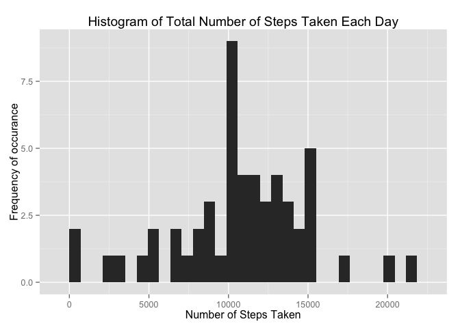
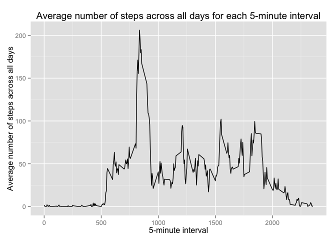
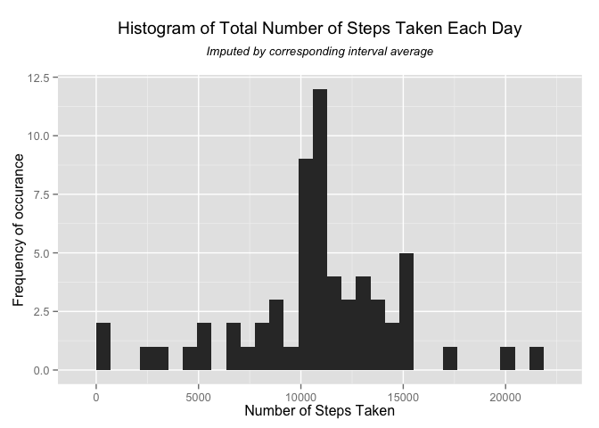
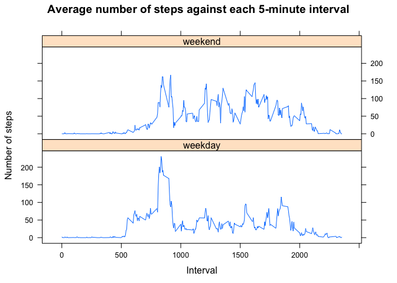

# Reproducible Research: Peer Assessment 1
Hiew Pang Leang  
20 September 2015  

________________________________________________________________________________
Load required libraries.


```r
# Set up the environment for the analysis
library(dplyr)
library(ggplot2)
library(lattice)
```


________________________________________________________________________________
## Loading and preprocessing the data
___
Show any code that is needed to  
&nbsp;&nbsp;&nbsp;&nbsp;1. Load the data (i.e. read.csv())  
&nbsp;&nbsp;&nbsp;&nbsp;2. Process/transform the data (if necessary) into a format suitable for your analysis  


```r
if(!file.exists('activity.csv')){
    unzip('activity.zip')
}
data_raw <- read.csv("activity.csv", colClasses = c("integer", "Date", "integer"))
data_noNA <- na.omit(data_raw)
data_grouped <- group_by(data_noNA, date)
data_summarized <- summarise(data_grouped, steps = sum(steps))
```


________________________________________________________________________________
## What is mean total number of steps taken per day?
___
For this part of the assignment, you can ignore the missing values in the dataset.  
&nbsp;&nbsp;&nbsp;&nbsp;1. Make a histogram of the total number of steps taken each day  


```r
ggplot(data_summarized, aes(x=steps)) + geom_histogram() + labs(title = "Histogram of Total Number of Steps Taken Each Day", x = "Number of Steps Taken", y = "Frequency of occurance")
```

 


<BR></BR>
&nbsp;&nbsp;&nbsp;&nbsp;2. Calculate and report the mean and median total number of steps taken per day  


```r
average <- floor(mean(data_summarized$steps))
med <- floor(median(data_summarized$steps))
```

Excluding the dates/time where data is not available, the mean total number of steps taken per day is **10766** and the median total number of steps taken per day is **10765**.


________________________________________________________________________________
## What is the average daily activity pattern?
___
1. Make a time series plot (i.e. type = "l") of the 5-minute interval (x-axis) and the average number of steps taken, averaged across all days (y-axis)  


```r
data_grouped <- group_by(data_noNA, interval)
data_summarized <- summarise(data_grouped, steps = mean(steps))
average_steps_by_interval <- data_summarized                     # Required for later part of the calculation to impute NAs
ggplot(data_summarized, aes(interval, steps)) + geom_line() + labs(title = "Average number of steps across all days for each 5-minute interval", x = "5-minute interval", y = "Average number of steps across all days")
```

 


<BR></BR>
2. Which 5-minute interval, on average across all the days in the dataset, contains the maximum number of steps?  


```r
max_interval <- data_summarized[which.max(data_summarized$steps), ]$interval
max_interval
```

```
## [1] 835
```

The 5-minute interval with the maxumum number of steps is at **835**. 


________________________________________________________________________________
## Imputing missing values
___
Note that there are a number of days/intervals where there are missing values (coded as NA). The presence of missing days may introduce bias into some calculations or summaries of the data.  
&nbsp;&nbsp;&nbsp;&nbsp;1. Calculate and report the total number of missing values in the dataset (i.e. the total number of rows with NAs)  


```r
number_of_NA <- sum(is.na(data_raw$steps))
number_of_NA
```

```
## [1] 2304
```

The total number of missing values in the dataset is **2304**.

<BR></BR>
&nbsp;&nbsp;&nbsp;&nbsp;2. Devise a strategy for filling in all of the missing values in the dataset. The strategy does not need to be sophisticated. For example, you could use the mean/median for that day, or the mean for that 5-minute interval, etc.


A straight forward <u>***simplistic approach***</u> is to use the impute() function from the *Hmisc* library, which by default, impute the missing NA with the *median* for the entire non-NAs 5-minute interval population (ie. across all the days excluding the NAs). Given that the median of steps for the 5-minute interval for this data set is **0**, the decision is to use the *mean* for entire non-NAs 5-minute interval population, which in the case of this data set is **37.3825996**.


```r
library(Hmisc)

data_imputed <- data_raw
data_imputed$steps <- impute(data_raw$steps, fun=mean)
```


```r
data_grouped <- group_by(data_imputed, date)
data_summarized <- summarise(data_grouped, steps = sum(steps))
ggplot(data_summarized, aes(x=steps)) + geom_histogram() + labs(x = "Number of Steps Taken", y = "Frequency of occurance") + ggtitle(expression(atop("Histogram of Total Number of Steps Taken Each Day", atop(italic("Imputed by interval population average"), ""))))
```

 


```r
average_imputed1 <- floor(mean(data_summarized$steps))
med_imputed1 <- floor(median(data_summarized$steps))
```

The imputed mean total number of steps taken per day is **10766** and the imputed median total number of steps taken per day is **10766**.

<BR></BR>

<u>***Alternative approach***</u> is to impute the NA of a particular time internal with the corresponsing average for the same time interval calculate under "Average number of steps across all days for each 5-minute interval" from the earlier section. The rational for this strategy is based on the assumption the test subject (who generated this test data set) is going to be rather routine in his/her daily activity and hence using the average calculated for each time interval would be a better estimate for the missing values.

<BR></BR>
&nbsp;&nbsp;&nbsp;&nbsp;3. Create a new dataset that is equal to the original dataset but with the missing data filled in. 


```r
data_imputed <- data_raw
for (i in 1:nrow(data_imputed)) {
    if (is.na(data_imputed$steps[i])) {
       data_imputed$steps[i] <- average_steps_by_interval$steps[which(average_steps_by_interval$interval == data_imputed$interval[i])]
    }
}
```


<BR></BR>
&nbsp;&nbsp;&nbsp;&nbsp;4. Make a histogram of the total number of steps taken each day and Calculate and report the mean and median total number of steps taken per day. Do these values differ from the estimates from the first part of the assignment? What is the impact of imputing missing data on the estimates of the total daily number of steps?


```r
data_grouped <- group_by(data_imputed, date)
data_summarized <- summarise(data_grouped, steps = sum(steps))
ggplot(data_summarized, aes(x=steps)) + geom_histogram() + labs(x = "Number of Steps Taken", y = "Frequency of occurance") + ggtitle(expression(atop("Histogram of Total Number of Steps Taken Each Day", atop(italic("Imputed by corresponding interval average"), ""))))
```

 


```r
average_imputed2 <- floor(mean(data_summarized$steps))
med_imputed2 <- floor(median(data_summarized$steps))
```

Now the imputed mean total number of steps taken per day is **10766** and the imputed median total number of steps taken per day is **10766**.

We can work out the impact of the two different imputing operations:


```r
average_dif1 <- average - average_imputed1
med_dif1 <- med - med_imputed1
average_dif2 <- average - average_imputed2
med_dif2 <- med - med_imputed2
```

By the <u>***Simplistic approach***</u> of replacing the NAs with the *mean* for entire non-NAs 5-minute interval population, the difference between the mean of the original data set (excluding the NAs) and the mean of the imputed data set is **0**, and the difference between the medians is **-1**.

By the <u>***Alternative approach***</u> of imputing the NA of a particular time internal with the corresponsing average for the same time interval calculate under "Average number of steps across all days for each 5-minute interval", the difference between the mean of the original data set (excluding the NAs) and the mean of the imputed data set is **0**, and the difference between the medians is **-1**.


________________________________________________________________________________
## Are there differences in activity patterns between weekdays and weekends?
___
For this part the weekdays() function may be of some help here. Use the dataset with the filled-in missing values for this part.  
&nbsp;&nbsp;&nbsp;&nbsp;1. Create a new factor variable in the dataset with two levels -- "weekday" and "weekend" indicating whether a given date is a weekday or weekend day.  


```r
data_imputed$day <- weekdays(data_imputed$date)
Sat_n_Sun <- c('Saturday', 'Sunday')
data_imputed$day <- ifelse(data_imputed$day %in% Sat_n_Sun, 'weekend', 'weekday')
```


<BR></BR>
&nbsp;&nbsp;&nbsp;&nbsp;2. Make a panel plot containing a time series plot (i.e. type = "l") of the 5-minute interval (x-axis) and the average number of steps taken, averaged across all weekday days or weekend days (y-axis). The plot should look something like the following, which was created using simulated data:


```r
data_for_plot <- aggregate(steps ~ interval + day, data_imputed, mean)
xyplot(data_for_plot$steps ~ data_for_plot$interval | data_for_plot$day, layout=c(1,2), type="l", main="Average number of steps against each 5-minute interval", xlab="Interval", ylab="Number of steps")
```

 

  
________________________________________________________________________________
